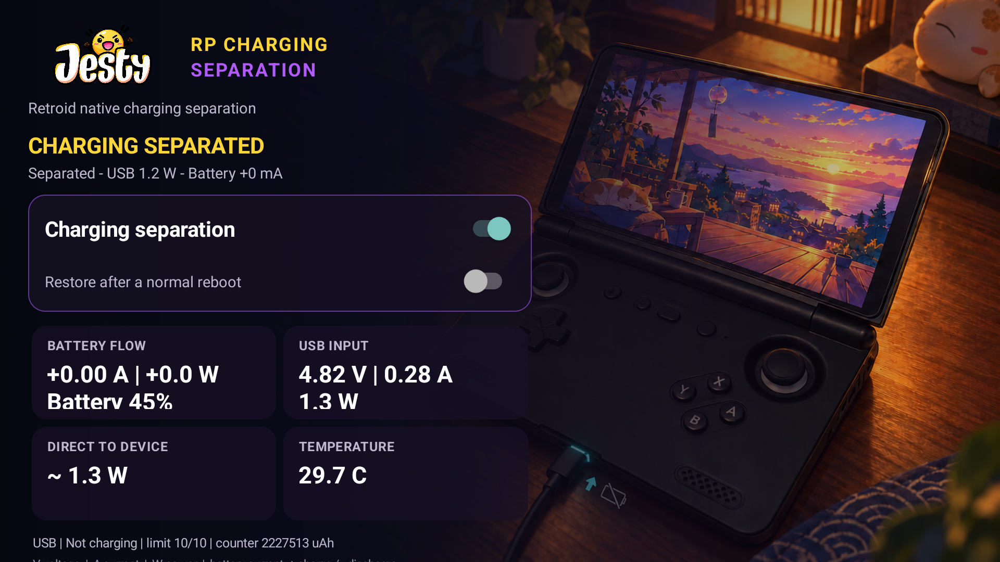
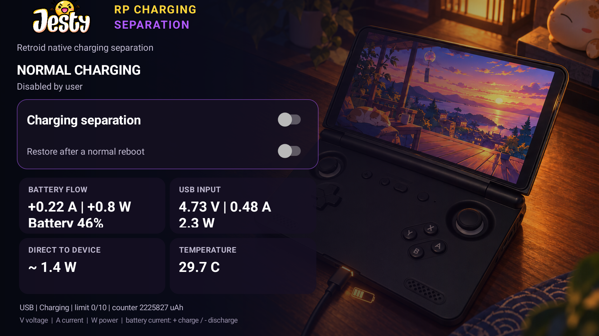

<p align="center">
  
</p>

<p align="center">
  <strong>Play while plugged in without continuously charging the battery.</strong><br>
  Uses Retroid's own charging controls on the Pocket 5 and Pocket Flip 2, with live battery/USB monitoring and automatic safety checks.
</p>

<p align="center">
  <strong>No rooting the device. No Magisk. No terminal. No need to keep the app open.</strong><br>
  Install it, enable Charging Separation, and forget about it.
</p>

<p align="center">
  
  
  
  
  
</p>

<p align="center">
  <a href="https://github.com/JestyLabs/Jesty-RP-Charging-Separation/releases/tag/v1.3.0"><strong>Download APK</strong></a>
  · <a href="#what-does-it-do">How it works</a>
  · <a href="docs/BENCHMARKS.md">Measurements and raw data</a>
  · <a href="https://www.buymeacoffee.com/jesty">☕ Support development</a>
</p>

<p align="center">
  
</p>

> [!WARNING]
> **Made for compatible Retroid handhelds.** This is an unofficial community
> project and is not made, supported, or endorsed by Retroid. It uses Retroid's
> built-in privileged `PServerBinder` service, so you do **not** need to root the
> device yourself or install Magisk. Firmware changes or unsupported hardware can
> still affect compatibility, so read the safety notes before enabling it on an
> untested device or firmware version.

## The simple version

Normally, when you plug your Retroid into USB, the charger does two things:

1. powers the handheld;
2. charges the battery.

That is fine most of the time. But during a long gaming session, docked setup,
or overnight use, you may want USB to keep powering the handheld **without
continuously charging the battery at the same time**.

**Jesty RP Charging Separation lets compatible Retroid devices stop actively
charging the battery while USB stays connected and continues supplying the
running handheld.**

For normal use, it is designed to be almost completely hands-off:

- **No rooting the device**
- **No Magisk**
- **No terminal commands**
- Install the APK and enable Charging Separation
- You do **not** need to keep the dashboard open
- You can **swipe the app away from Recents**
- The background controller keeps working
- Optional restore after a normal reboot
- Automatic fallback to normal charging if safety checks fail
- Designed for **minimal background CPU and battery overhead**
- Does **not** change CPU governors, CPU frequencies, or unrelated system settings

Basically:

**install → enable → forget about it**

## What does it do?

| | Normal charging | Charging Separation |
| --- | --- | --- |
| USB connected | Yes | **Yes** |
| Handheld keeps running from external power | Yes | **Yes** |
| Battery actively charging | Yes | **No** |
| Android battery state | `Charging` | **`Not charging`** |
| Live battery / USB monitoring | Yes | **Yes** |
| Automatic safety checks | — | **Yes** |
| App needs to stay open | — | **No** |
| Can be removed from Recents | — | **Yes** |
| Magisk / rooting required | — | **No** |

You can turn Charging Separation on from the app, see what the battery and
charger are doing in real time, and return to normal charging whenever you want.

### See both states

| Charging separated | Normal charging |
| --- | --- |
|  |  |

## Why use it?

- **Play plugged in without continuously charging the battery.**
- **Uses Retroid's own charging controls** instead of a generic Android battery hack.
- **No rooting, Magisk setup, or terminal commands required.**
- **Keeps working without the dashboard open.**
- **Keeps working after being swiped away from Recents.**
- **Shows live battery current, USB power, temperature and charging state.**
- **Checks that Charging Separation actually activated** before reporting success.
- **Automatically restores normal charging if the safety checks fail.**
- **Can restore your preferred state after a normal reboot** if you enable that option.
- **Does not change CPU governors or CPU frequencies.**

> [!NOTE]
> Charging Separation does **not** mean the battery is physically disconnected.
> Small positive or negative battery currents can still appear depending on load,
> charger, firmware and battery state. The goal is to stop active charging while
> external power continues supplying the handheld.

## Supported devices

| Device | Current evidence |
| --- | --- |
| **Retroid Pocket Flip 2** | Public APK installed, measured and repeatedly tested |
| **Retroid Pocket 5** | Successfully tested; more repeat telemetry is welcome |
| Other Retroid models | Not validated yet — treat as unsupported until tested |
| Unrelated Android devices | Unsupported |

The app checks for the Retroid firmware controls it needs before enabling
Charging Separation.

For technical reference, those controls include:

```text
/sys/class/power_supply/battery/charge_control_limit
/sys/class/power_supply/battery/charge_control_limit_max
```

The app also relies on Retroid's built-in privileged `PServerBinder` service.

## Measured on a Retroid Pocket Flip 2

A controlled comparison captured 30 one-second samples per state using the same
USB cable, screen state, workload and ambient conditions:

| Metric | Normal charging | Charging separated |
| --- | ---: | ---: |
| Android state | `Charging` | **`Not charging`** |
| Native limit | `0/10` | **`10/10`** |
| Average battery current | +0.239 A | **-0.011 A** |
| Charge-counter change | +2,449 uAh | **-109 uAh** |
| Average USB input | 2.286 W | **1.379 W** |
| Direct-to-device proxy | 1.368 W | 1.422 W |
| Battery temperature | 29.7 C | 29.7 C |

The important part is the overall behavior: when Charging Separation was
enabled, Android changed to **Not charging**, battery current dropped to roughly
zero, and the handheld continued running with USB connected.

The similar direct-to-device power estimate is consistent with USB continuing
to supply the handheld while the charging component disappeared.

> [!NOTE]
> This is a short functional test, not a battery-health or battery-longevity
> study. Charger, workload, firmware, temperature and battery state can all
> change the numbers. See [docs/BENCHMARKS.md](docs/BENCHMARKS.md) for the full
> methodology and sanitized raw samples.

## Built-in safety checks

The app does more than simply flip a setting.

Before and while Charging Separation is active, it:

- checks that the expected Retroid charging controls are available;
- verifies the new charging limit after changing it;
- confirms Android reports `Not charging`;
- monitors USB input, battery current, charge counter and temperature;
- restores normal charging if validation or telemetry fails;
- automatically disables separation after repeated samples indicating that the
  battery may be powering the handheld instead of USB.

It does **not** change CPU governors, CPU frequencies, display settings or
unrelated Android system properties.

## Installation

1. Download `Jesty-RP-Charging-Separation-1.3.0.apk` from the
   [GitHub release](https://github.com/JestyLabs/Jesty-RP-Charging-Separation/releases/tag/v1.3.0).
2. Install and open **Jesty RP Charging Separation**.
3. Connect a suitable USB charger.
4. Enable **Charging Separation**.
5. Confirm the app reports `Not charging`.
6. That's it.

If you want to watch what is happening, the dashboard shows live battery, USB
and temperature information — but **you do not need to leave it open**.

### You do not need to

- root the Retroid yourself;
- install Magisk;
- run ADB or terminal commands;
- leave the app open;
- leave the app in Recents;
- manually keep checking the dashboard.

The public package is `com.jesty.rpchargingseparation`. It installs separately
from private GracaBlockBat development builds created before the public rebrand.

## Everyday behavior

Once enabled, the intended normal experience is **install and forget**.

- While active or armed, the controller runs as an Android foreground service.
- Closing the dashboard does not normally stop it.
- Swiping the app away from Recents does not normally stop it.
- The background controller continues monitoring the charging state.
- **Restore after a normal reboot** is optional.
- Turning Charging Separation off restores normal charging.
- A safety failure restores normal charging automatically.
- Background monitoring is deliberately lightweight and designed for minimal overhead.

**Android Settings -> Force stop is different.** Force stop explicitly tells
Android to stop the app and prevents the app and its boot receiver from running
again until you open it manually. Swiping it away from Recents is fine; Force
stop is not the same thing.

<details>
<summary><strong>Technical implementation</strong></summary>

The app calls Android's hidden service manager to reach Retroid's
`PServerBinder`. The vendor transaction accepts a two-element String array and
runs a narrowly scoped command through Retroid's privileged `pservice` path.

Before reporting success, the app verifies the control node, reads back the
limit, checks Android's battery status, and starts continuous safety telemetry.

See [docs/ARCHITECTURE.md](docs/ARCHITECTURE.md) for the protocol, state machine
and failure behavior.

</details>

<details>
<summary><strong>Building from source</strong></summary>

Requirements: PowerShell 5.1+, Android SDK platform 28+, Android Build Tools
34+, and JDK 17.

```powershell
.\build.ps1
```

Signing is deliberately opt-in and reads the password interactively. Keys,
passwords, APKs, device captures, and local SDK paths do not belong in Git.

</details>

## Support and contribute

**Jesty RP Charging Separation is free and open source.**

If the project is useful to you, there are several ways you can help:

- ⭐ **Star the repository** so other Retroid owners can find it.
- 🧪 **Test another firmware or compatible Retroid device** and share carefully redacted results.
- 🐛 **Report bugs or compatibility issues.**
- 💡 **Suggest improvements** or contribute code/documentation.
- ☕ **[Buy me a coffee](https://www.buymeacoffee.com/jesty)** to help fund
  additional device testing, safety work, firmware compatibility and future updates.

Testing and compatibility reports are just as valuable as financial support.

<p align="center">
  <a href="https://www.buymeacoffee.com/jesty">
    
  </a>
</p>

When reporting a compatibility issue, please include the exact device, firmware,
charger and carefully redacted telemetry. Never upload a keystore, password,
device serial, account email or unreviewed log bundle.

## Documentation

- [Architecture](docs/ARCHITECTURE.md)
- [Device validation checklist](docs/DEVICE-VALIDATION.md)
- [Live results](docs/LIVE-RESULTS.md)
- [Benchmarks and raw samples](docs/BENCHMARKS.md)
- [Release integrity](docs/RELEASE-INTEGRITY.md)
- [AI assistance disclosure](AI_DISCLOSURE.md)

## License and credits

- Source code and build scripts: [GPL-3.0](LICENSE).
- Jesty name, mascot, wordmark, and project artwork: [ASSETS-LICENSE.md](ASSETS-LICENSE.md).
- Third-party Android and Retroid names: [THIRD_PARTY_NOTICES.md](THIRD_PARTY_NOTICES.md).

This project is not affiliated with or endorsed by Retroid. It was developed
with disclosed generative-AI assistance under the maintainer's direction.
